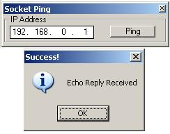



## Raw Socket Ping \(Multiple Instance Support\)

### Description

This is just a Simple example of pinging using RAW sockets. The idea of this code it to be used in multi-instancing of ICMP requests (Used for Ping Sweeping ect.). Also shows use of Subclassing. Please Comment and vote.
 
### More Info
 

             |
---                |---
**Submitted On**   |2003-08-03 18:11:24
**By**             |[�e7eN](https://github.com/Planet-Source-Code/PSCIndex/blob/master/ByAuthor/e7en.md)
**Level**          |Beginner
**User Rating**    |5.0 (45 globes from 9 users)
**Compatibility**  |VB 5\.0, VB 6\.0
**Category**       |[Miscellaneous](https://github.com/Planet-Source-Code/PSCIndex/blob/master/ByCategory/miscellaneous__1-1.md)
**World**          |[Visual Basic](https://github.com/Planet-Source-Code/PSCIndex/blob/master/ByWorld/visual-basic.md)
**Archive File**   |[Raw\_Socket1655421082003\.zip](https://github.com/Planet-Source-Code/e7en-raw-socket-ping-multiple-instance-support__1-49090/archive/master.zip)

